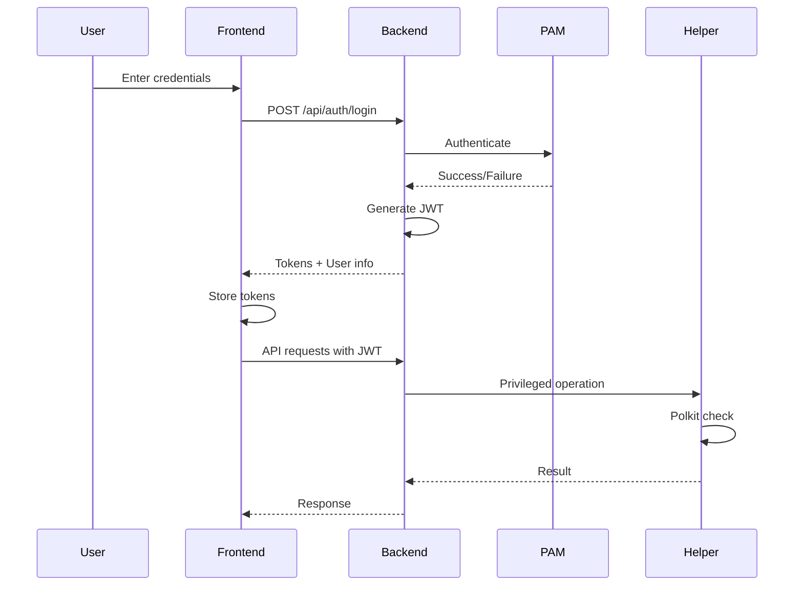
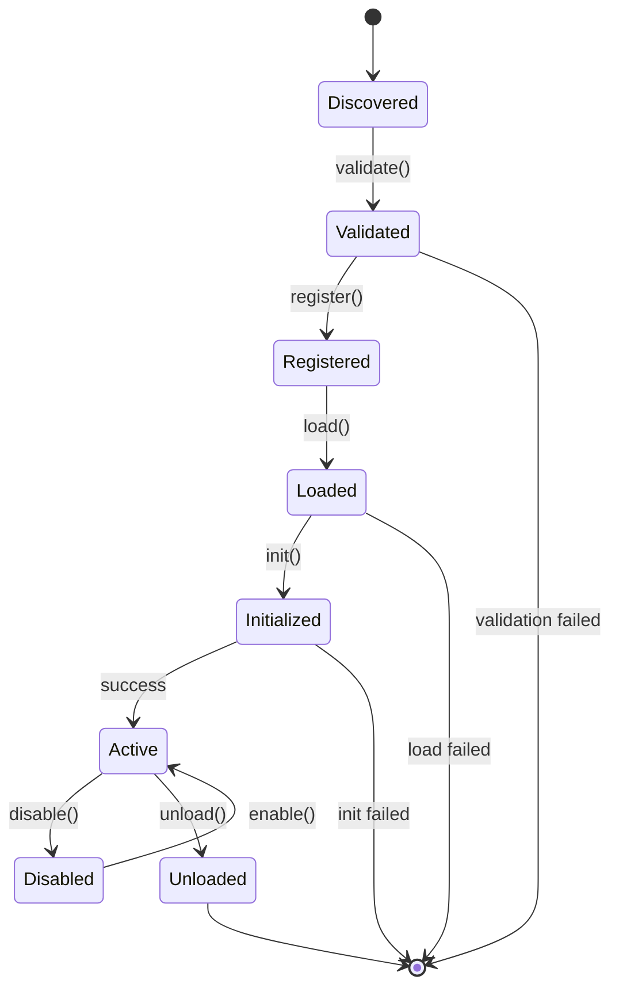

# NixOS GUI Architecture

## Table of Contents

1. [Overview](#overview)
2. [System Architecture](#system-architecture)
3. [Component Design](#component-design)
4. [Security Architecture](#security-architecture)
5. [Data Flow](#data-flow)
6. [Technology Stack](#technology-stack)
7. [API Design](#api-design)
8. [Performance Considerations](#performance-considerations)
9. [Deployment Architecture](#deployment-architecture)

## Overview

NixOS GUI follows a multi-tier architecture designed for security, performance, and maintainability. The system separates concerns between presentation, business logic, and system operations.

### Design Principles

1. **Security First**: Privilege separation and defense in depth
2. **Performance**: Lazy loading and efficient caching
3. **Maintainability**: Modular design with clear boundaries
4. **Extensibility**: Plugin architecture for future growth
5. **Reliability**: Fault tolerance and graceful degradation
6. **User Experience**: Contextual help and intuitive interfaces

## System Architecture

```
┌─────────────────────────────────────────────────────────────┐
│                        Web Browser                          │
│  ┌─────────────────────────────────────────────────────┐   │
│  │              Single Page Application (SPA)           │   │
│  │  ┌─────────┐ ┌─────────┐ ┌─────────┐ ┌──────────┐ │   │
│  │  │Dashboard│ │Packages │ │Services │ │  Config  │ │   │
│  │  └─────────┘ └─────────┘ └─────────┘ └──────────┘ │   │
│  │  ┌─────────────────────────────────────────────────┐│   │
│  │  │            State Management (Redux)             ││   │
│  │  └─────────────────────────────────────────────────┘│   │
│  └─────────────────────────────────────────────────────┘   │
└────────────────────┬───────────────────┬───────────────────┘
                     │ HTTPS             │ WebSocket
          ┌──────────▼──────────┐        │
          │   Load Balancer     │        │
          │     (nginx)         │        │
          └──────────┬──────────┘        │
                     │                   │
┌────────────────────▼───────────────────▼───────────────────┐
│                    Web Server Layer                        │
│  ┌─────────────────────────────────────────────────────┐  │
│  │               Express.js Application                 │  │
│  │  ┌──────────┐ ┌──────────┐ ┌──────────┐ ┌────────┐│  │
│  │  │   Auth   │ │   API    │ │WebSocket │ │ Static ││  │
│  │  │ Handler  │ │ Routes   │ │ Handler  │ │ Files  ││  │
│  │  └──────────┘ └──────────┘ └──────────┘ └────────┘│  │
│  └─────────────────────────────────────────────────────┘  │
└────────────────────────────────────────────────────────────┘
                             │
                             │ IPC
                             │
┌────────────────────────────▼───────────────────────────────┐
│                  System Operations Layer                    │
│  ┌─────────────────────────────────────────────────────┐  │
│  │           Privileged Helper Service (C)             │  │
│  │  ┌──────────┐ ┌──────────┐ ┌──────────┐ ┌────────┐│  │
│  │  │   Nix    │ │ Systemd  │ │   File   │ │ Polkit ││  │
│  │  │Operations│ │ Control  │ │ System   │ │ Auth   ││  │
│  │  └──────────┘ └──────────┘ └──────────┘ └────────┘│  │
│  └─────────────────────────────────────────────────────┘  │
└────────────────────────────────────────────────────────────┘
                             │
                             │ System Calls
                             │
┌────────────────────────────▼───────────────────────────────┐
│                      NixOS System                          │
│  ┌──────────┐ ┌──────────┐ ┌──────────┐ ┌──────────────┐ │
│  │   Nix    │ │ Systemd  │ │   File   │ │Configuration │ │
│  │  Store   │ │ Services │ │  System  │ │    Files     │ │
│  └──────────┘ └──────────┘ └──────────┘ └──────────────┘ │
└────────────────────────────────────────────────────────────┘
```

## Component Design

### Frontend Components

#### Single Page Application (SPA)
- **Framework**: React 18 with TypeScript
- **State Management**: Redux Toolkit
- **Routing**: React Router v6
- **UI Components**: Custom component library
- **Styling**: CSS Modules with PostCSS

#### Key Frontend Modules

1. **Core Module**
   - App initialization
   - Authentication management
   - Global state setup
   - Error boundaries

2. **Package Management Module**
   - Package search interface
   - Installation/removal workflows
   - Dependency visualization
   - Package details display

3. **Configuration Module**
   - Monaco editor integration
   - Syntax highlighting
   - Real-time validation
   - Diff visualization

4. **Service Management Module**
   - Service list with filtering
   - Start/stop controls
   - Log viewer integration
   - Resource monitoring

### Backend Components

#### Web Server
- **Framework**: Express.js with TypeScript
- **Authentication**: JWT with refresh tokens
- **Session Management**: Redis-backed sessions
- **API Documentation**: OpenAPI 3.0
- **Logging**: Winston with rotation

#### Key Backend Services

1. **Authentication Service**
   ```typescript
   class AuthService {
     authenticateUser(username: string, password: string): Promise<User>
     generateTokens(user: User): TokenPair
     refreshToken(refreshToken: string): Promise<AccessToken>
     logout(userId: string): Promise<void>
   }
   ```

2. **Package Service**
   ```typescript
   class PackageService {
     searchPackages(query: string): Promise<Package[]>
     getPackageDetails(name: string): Promise<PackageDetails>
     installPackage(name: string): Promise<InstallResult>
     removePackage(name: string): Promise<RemoveResult>
   }
   ```

3. **Configuration Service**
   ```typescript
   class ConfigurationService {
     readConfiguration(): Promise<string>
     validateConfiguration(content: string): Promise<ValidationResult>
     writeConfiguration(content: string): Promise<void>
     createBackup(): Promise<BackupInfo>
   }
   ```

#### Privileged Helper
- **Language**: C for minimal dependencies
- **Communication**: Unix domain sockets
- **Authorization**: Polkit integration
- **Operations**: Isolated, atomic actions

## Security Architecture

### Defense in Depth

```
┌─────────────────────────────────────────────┐
│            Layer 1: Network Security        │
│  • HTTPS/TLS encryption                     │
│  • CORS policies                            │
│  • Rate limiting                            │
└─────────────────────────────────────────────┘
┌─────────────────────────────────────────────┐
│          Layer 2: Application Security      │
│  • JWT authentication                       │
│  • CSRF protection                          │
│  • Input validation                         │
│  • XSS prevention                          │
└─────────────────────────────────────────────┘
┌─────────────────────────────────────────────┐
│            Layer 3: System Security         │
│  • Privilege separation                     │
│  • Polkit authorization                     │
│  • Systemd sandboxing                      │
│  • File system restrictions                │
└─────────────────────────────────────────────┘
┌─────────────────────────────────────────────┐
│            Layer 4: Audit & Monitoring      │
│  • Comprehensive audit logging              │
│  • Intrusion detection                      │
│  • Anomaly detection                        │
│  • Security alerts                          │
└─────────────────────────────────────────────┘
```

### Authentication Flow



### Authorization Model

- **Role-Based Access Control (RBAC)**
  - Admin: Full system access
  - User: Limited to safe operations
  - Guest: Read-only access

- **Group-Based Permissions**
  - `wheel`: System administrators
  - `nixos-gui`: GUI users
  - Custom groups supported

## Data Flow

### Package Installation Flow

```
User Action          Frontend              Backend            Helper           System
     │                   │                    │                 │                │
     ├──Search──────────▶│                    │                 │                │
     │                   ├──API Request──────▶│                 │                │
     │                   │                    ├──Nix Search────▶│                │
     │                   │                    │                 ├──nix search───▶│
     │                   │                    │                 │◀──Results──────┤
     │                   │                    │◀──Package List──┤                │
     │                   │◀──Search Results───┤                 │                │
     │◀──Display─────────┤                    │                 │                │
     │                   │                    │                 │                │
     ├──Install─────────▶│                    │                 │                │
     │                   ├──Install Request──▶│                 │                │
     │                   │                    ├──Authorize─────▶│                │
     │                   │                    │                 ├──Polkit Check─▶│
     │                   │                    │                 │◀──Approved─────┤
     │                   │                    │                 ├──nix-env -i───▶│
     │                   │◀──Progress Updates─┤◀──Output Stream─┤◀──Build Output┤
     │◀──Status Updates──┤                    │                 │                │
     │                   │                    │                 │◀──Success──────┤
     │                   │◀──Success─────────┤◀──Complete──────┤                │
     │◀──Notification────┤                    │                 │                │
```

### Real-time Updates

- **WebSocket Events**
  - System changes
  - Build progress
  - Service status updates
  - Configuration changes

- **Event Types**
  ```typescript
  interface SystemEvent {
    type: 'package.installed' | 'service.started' | 'config.changed'
    timestamp: number
    data: any
    user: string
  }
  ```

## Technology Stack

### Frontend
- **Core**: React 18, TypeScript 5
- **State**: Redux Toolkit, RTK Query
- **UI**: Custom components, CSS Modules
- **Build**: Webpack 5, Babel
- **Testing**: Jest, React Testing Library

### Backend
- **Runtime**: Node.js 20 LTS
- **Framework**: Express.js 4
- **Language**: TypeScript 5
- **Database**: SQLite (audit logs)
- **Cache**: Redis (sessions)
- **Testing**: Jest, Supertest

### System Integration
- **Helper**: C with GCC
- **IPC**: Unix sockets
- **Auth**: PAM, Polkit
- **Process**: systemd

### Development Tools
- **Package Manager**: npm/pnpm
- **Linting**: ESLint, Prettier
- **Git Hooks**: Husky
- **CI/CD**: GitHub Actions

## API Design

### RESTful Endpoints

```
Authentication
  POST   /api/auth/login          Login
  POST   /api/auth/logout         Logout
  POST   /api/auth/refresh        Refresh token
  GET    /api/auth/verify         Verify token

Packages
  GET    /api/packages            List installed
  GET    /api/packages/search     Search available
  GET    /api/packages/:name      Package details
  POST   /api/packages/install    Install package
  DELETE /api/packages/:name      Remove package

Configuration
  GET    /api/config              Read configuration
  POST   /api/config/validate     Validate syntax
  PUT    /api/config              Write configuration
  POST   /api/config/backup       Create backup
  GET    /api/config/diff         Show changes

Services
  GET    /api/services            List services
  GET    /api/services/:name      Service details
  POST   /api/services/:name/start    Start service
  POST   /api/services/:name/stop     Stop service
  POST   /api/services/:name/restart  Restart service
  GET    /api/services/:name/logs     View logs

System
  GET    /api/system/info         System information
  GET    /api/system/generations  List generations
  POST   /api/system/rebuild      Rebuild system
  POST   /api/system/rollback     Rollback
  GET    /api/system/metrics      Performance metrics
```

### WebSocket Events

```typescript
// Client to Server
interface ClientMessage {
  type: 'subscribe' | 'unsubscribe'
  channel: 'packages' | 'services' | 'config' | 'system'
}

// Server to Client
interface ServerMessage {
  type: 'update' | 'progress' | 'error'
  channel: string
  data: any
}
```

## Performance Considerations

### Frontend Optimization
- **Code Splitting**: Lazy load routes and heavy components
- **Bundle Optimization**: Tree shaking, minification
- **Asset Optimization**: Image compression, CDN
- **Caching**: Service worker for offline support
- **Virtual Scrolling**: For large lists

### Backend Optimization
- **Query Optimization**: Indexed searches, pagination
- **Caching Strategy**: Redis for frequent queries
- **Connection Pooling**: Reuse database connections
- **Async Operations**: Non-blocking I/O
- **Load Balancing**: Multiple worker processes

### System Integration
- **Batch Operations**: Group system calls
- **Progress Streaming**: Real-time output
- **Resource Limits**: CPU and memory quotas
- **Queue Management**: Job queue for heavy operations

## Deployment Architecture

### Single Server
```
┌─────────────────────┐
│      nginx          │
│  (Reverse Proxy)    │
└──────────┬──────────┘
           │
┌──────────▼──────────┐
│   NixOS GUI Web     │
│   localhost:8080    │
└──────────┬──────────┘
           │
┌──────────▼──────────┐
│   Helper Service    │
│   (Privileged)      │
└─────────────────────┘
```

### High Availability
```
        ┌─────────────────┐
        │  Load Balancer  │
        └────────┬────────┘
                 │
     ┌───────────┴───────────┐
     │                       │
┌────▼──────┐         ┌──────▼────┐
│  Server 1 │         │  Server 2 │
│  NixOS GUI│         │ NixOS GUI │
└────┬──────┘         └──────┬────┘
     │                       │
     └───────────┬───────────┘
                 │
        ┌────────▼────────┐
        │  Shared State   │
        │  (Redis/NFS)    │
        └─────────────────┘
```

### Container Deployment
```yaml
version: '3.8'
services:
  nixos-gui:
    image: nixos/nixos-gui:latest
    ports:
      - "8080:8080"
    volumes:
      - /etc/nixos:/etc/nixos
      - /nix:/nix:ro
    environment:
      - NODE_ENV=production
    privileged: true  # Required for system operations
```

## Future Considerations

### Planned Enhancements
1. **GraphQL API**: More flexible queries
2. **Microservices**: Split into smaller services
3. **Kubernetes**: Cloud-native deployment
4. **Multi-tenancy**: Manage multiple systems
5. **Mobile Apps**: Native iOS/Android clients

### Extensibility
- **Plugin Architecture**: Third-party extensions
- **Theme System**: Custom UI themes
- **API Versioning**: Backward compatibility
- **Webhook Support**: External integrations
- **Custom Modules**: User-defined functionality

## Plugin System Architecture

### Overview

The plugin system provides a secure, sandboxed environment for extending NixOS GUI functionality without modifying core code.

```
┌─────────────────────────────────────────────────────────────┐
│                     Plugin Ecosystem                         │
├─────────────────────────────────────────────────────────────┤
│  ┌─────────────┐  ┌─────────────┐  ┌─────────────┐        │
│  │   Plugin 1  │  │   Plugin 2  │  │   Plugin 3  │  ...   │
│  │  (Isolated) │  │  (Isolated) │  │  (Isolated) │        │
│  └──────┬──────┘  └──────┬──────┘  └──────┬──────┘        │
│         │                 │                 │                │
│  ┌──────▼─────────────────▼─────────────────▼──────┐        │
│  │              Plugin API (Restricted)             │        │
│  │  ┌──────┐ ┌─────────┐ ┌──────────┐ ┌────────┐ │        │
│  │  │  UI  │ │ Storage │ │ Settings │ │ Events │ │        │
│  │  └──────┘ └─────────┘ └──────────┘ └────────┘ │        │
│  └─────────────────────┬───────────────────────────┘        │
│                        │                                     │
│  ┌─────────────────────▼───────────────────────────┐        │
│  │            Plugin System Core (Sandbox)          │        │
│  │  ┌─────────────┐ ┌──────────┐ ┌──────────────┐│        │
│  │  │   Loader    │ │Validator │ │Hook Registry ││        │
│  │  └─────────────┘ └──────────┘ └──────────────┘│        │
│  └──────────────────────────────────────────────────┘        │
└─────────────────────────────────────────────────────────────┘
                              │
                              ▼
                    ┌─────────────────┐
                    │   Core System   │
                    └─────────────────┘
```

### Security Model

1. **Sandboxed Execution**
   - Plugins run in isolated VM contexts
   - No access to Node.js modules or system APIs
   - Restricted global scope

2. **Permission System**
   ```javascript
   permissions: ['ui', 'storage', 'notifications', 'settings', 'events']
   ```

3. **Code Validation**
   - Static analysis for dangerous patterns
   - Metadata validation
   - Size limits enforcement

4. **Resource Limits**
   - Memory usage caps
   - Execution time limits
   - Storage quotas per plugin

### Plugin Lifecycle



### Plugin API

#### UI API
```typescript
interface UIApi {
  addDashboardWidget(options: WidgetOptions): string
  addToolbarButton(options: ButtonOptions): string
  addMenuItem(menu: string, options: MenuItemOptions): string
  showModal(options: ModalOptions): void
  removeWidget(widgetId: string): void
}
```

#### Storage API
```typescript
interface StorageApi {
  get(key: string): any
  set(key: string, value: any): void
  remove(key: string): void
  clear(): void
}
```

#### Events API
```typescript
interface EventsApi {
  on(event: string, handler: Function): void
  off(event: string, handler: Function): void
  emit(event: string, data: any): void
}
```

### Plugin Repository

```
plugin-repository/
├── plugins/
│   ├── official/      # Maintained by NixOS GUI team
│   └── community/     # Community contributions
├── categories.json    # Plugin categorization
├── featured.json      # Featured plugins
└── registry.json      # Main registry
```

### Development Tools

1. **Plugin Creator**
   ```bash
   npm run create-plugin
   ```

2. **Plugin Tester**
   ```bash
   npm run test-plugin my-plugin.js
   ```

3. **Plugin Packager**
   ```bash
   npm run package-plugin my-plugin.js --minify
   ```

4. **Manifest Validator**
   ```bash
   npm run validate-manifest manifest.json
   ```

### Performance Considerations

- Lazy loading of plugins
- Efficient event delegation
- Minimal core API surface
- Caching of plugin metadata
- Background validation

### Future Plugin Enhancements

1. **Plugin Dependencies**: Allow plugins to depend on others
2. **Plugin Store UI**: In-app browsing and installation
3. **Auto-updates**: Automatic plugin updates
4. **Plugin Analytics**: Usage statistics (opt-in)
5. **Plugin Marketplace**: Monetization options