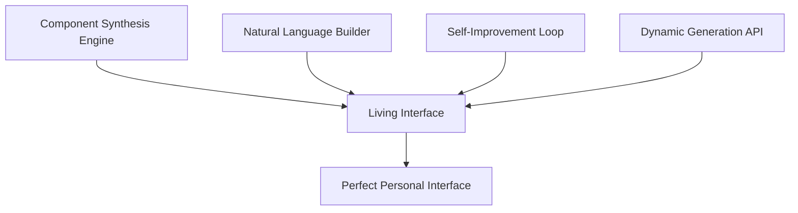

# 🌟 Dynamic AI-Generated Interface Vision

*A living system where interfaces are born from conversation, evolve through interaction, and become perfect through understanding*

## Executive Summary

This document outlines the vision and architecture for a revolutionary interface system where:
- **AI generates custom interfaces** in real-time based on natural language requests
- **Components synthesize themselves** from requirements, not pre-defined templates  
- **Interfaces evolve autonomously** through continuous learning and adaptation
- **Every user gets a unique interface** perfectly suited to their needs and preferences

## 🎯 Core Vision

### The Ultimate Goal
Create an interface system that can build itself based on what users need, when they need it, how they prefer it - all through natural conversation and observation.

**User Experience:**
```
User: "I need a dashboard to monitor my server with a calming theme"
AI: [Generates complete dashboard with real-time metrics, soft colors, gentle animations]

User: "Make it simpler, I'm feeling overwhelmed"
AI: [Dynamically reduces complexity, hides non-critical information, increases spacing]

User: [Uses dashboard for a week]
AI: [Learns patterns, optimizes layout, predicts needed information, evolves automatically]
```

## 🏗️ Architecture Overview

### Four Pillars of Dynamic Generation



### 1. Component Synthesis Engine
**Purpose:** Create entirely new components from requirements

**Key Features:**
- Generate components from semantic descriptions
- Combine primitives into complex components
- Learn successful patterns for reuse
- Evolve component designs over time

**Example:**
```typescript
// AI receives requirement
"Need a way to visualize network traffic that feels organic"

// Synthesizes new component
{
  type: "OrganicNetworkFlow",
  visual: "flowing-particles",
  data: "network-metrics",
  behavior: "ebbs-and-flows",
  style: "bioluminescent"
}
```

### 2. Natural Language Interface Builder
**Purpose:** Transform human desires into functional interfaces

**Key Features:**
- Parse natural language into interface requirements
- Understand context and intent
- Generate complete interfaces from descriptions
- Learn user's communication style

**Example Flow:**
```python
Input: "Show me my tasks but make it fun"
↓
Intent: {action: "display", target: "tasks", modifier: "fun"}
↓
Components: [AnimatedTaskCards, ConfettiCompletions, ProgressCelebration]
↓
Layout: Playful grid with gamification elements
↓
Result: Engaging task management interface
```

### 3. AI Self-Improvement Loop
**Purpose:** Continuously evolve interfaces without human intervention

**Key Features:**
- Monitor all user interactions
- Identify friction and inefficiencies  
- Generate and test improvements
- Apply successful changes automatically
- Learn from every interaction

**Evolution Cycle:**
```
Observe → Analyze → Hypothesize → Experiment → Learn → Apply
    ↑                                                       ↓
    ←←←←←←←←←←←←←←←←← Continuous Loop ←←←←←←←←←←←←←←←←←←←
```

### 4. Dynamic Component Generation API
**Purpose:** Provide programmatic interface creation capabilities

**Key Features:**
- Create components programmatically
- Modify components in real-time
- Compose complex interfaces from primitives
- Apply styles and behaviors dynamically
- Bind data sources automatically

## 🧬 Component DNA System

Every component has genetic-like information that defines its characteristics:

```typescript
interface ComponentDNA {
  // What it does
  purpose: SemanticPurpose;
  capabilities: Capability[];
  
  // How it looks
  visualGenetics: {
    family: "minimal" | "balanced" | "rich";
    expression: "subtle" | "moderate" | "bold";
    personality: "serious" | "friendly" | "playful";
  };
  
  // How it behaves
  behavioralTraits: {
    responsiveness: "immediate" | "smooth" | "deliberate";
    feedback: "minimal" | "informative" | "celebratory";
    intelligence: "passive" | "suggestive" | "predictive";
  };
  
  // How it evolves
  evolution: {
    mutability: "static" | "adaptive" | "evolutionary";
    learningSpe: number;
    generationLifespan: number;
  };
}
```

## 🌊 Implementation Phases

### Phase 1: Foundation (Weeks 1-2)
**Goal:** Establish core infrastructure

- [ ] Create component specification language
- [ ] Build basic synthesis engine
- [ ] Implement component DNA system
- [ ] Set up AI control interfaces
- [ ] Create primitive component library

### Phase 2: Intelligence (Weeks 3-4)
**Goal:** Add natural language understanding

- [ ] Build NL parser for interface requests
- [ ] Create intent recognition system
- [ ] Implement requirement extraction
- [ ] Build component selection logic
- [ ] Create layout generation algorithms

### Phase 3: Evolution (Weeks 5-6)
**Goal:** Enable autonomous improvement

- [ ] Implement interaction monitoring
- [ ] Build pattern analysis system
- [ ] Create A/B testing framework
- [ ] Implement learning algorithms
- [ ] Build automatic optimization system

### Phase 4: Synthesis (Weeks 7-8)
**Goal:** Full dynamic generation

- [ ] Complete synthesis engine
- [ ] Enable real-time generation
- [ ] Implement continuous evolution
- [ ] Add personalization system
- [ ] Polish and optimize

## 🎨 Use Cases

### Personal Dashboard
```
User: "Create a morning dashboard with weather, tasks, and news"
System: Generates personalized dashboard with:
- Weather widget with outfit suggestions
- Task list with priority highlighting
- News feed filtered by interests
- All styled to user's aesthetic preferences
```

### Creative Workspace
```
User: "I need a distraction-free writing environment"
System: Creates minimal interface with:
- Clean text editor
- Subtle word count
- Hidden menus
- Ambient background
- Focus timer
```

### Data Analysis Tool
```
User: "Show me sales data with trends"
System: Synthesizes analytics interface with:
- Interactive charts
- Trend indicators
- Predictive insights
- Drill-down capabilities
- Export options
```

## 🚀 Technical Requirements

### Core Technologies
- **Frontend:** Web Components + React/Vue/Solid
- **Component System:** Custom synthesis engine
- **NLP:** Local LLM for intent parsing
- **Learning:** Reinforcement learning for evolution
- **State:** Reactive state management
- **Communication:** WebSocket for real-time updates

### Performance Targets
- Component generation: <100ms
- NL parsing: <50ms
- Layout computation: <30ms
- Real-time modifications: 60fps
- Learning cycle: Background, non-blocking

### Compatibility
- **Browsers:** Chrome, Firefox, Safari, Edge
- **Devices:** Desktop, tablet, mobile
- **Accessibility:** WCAG AAA compliant
- **Localization:** Multi-language support

## 🔮 Future Possibilities

### Advanced Capabilities
1. **Cross-device Synchronization**: Interface follows user across devices
2. **Collaborative Evolution**: Learn from community patterns
3. **Predictive Generation**: Create interfaces before they're needed
4. **Emotional Adaptation**: Adjust based on user's emotional state
5. **AR/VR Extension**: Generate spatial interfaces

### Long-term Vision
- Interfaces that understand intent before it's expressed
- Components that evolve like living organisms
- Perfect personalization for every individual
- Zero learning curve for new users
- Technology that truly disappears

## 📊 Success Metrics

### Technical Metrics
- Generation accuracy: >95%
- User satisfaction: >90%
- Task completion time: -50%
- Learning convergence: <7 days
- System performance: Consistent 60fps

### User Experience Metrics
- Time to first value: <30 seconds
- Cognitive load: Reduced by 40%
- User retention: >80% after 30 days
- Feature discovery: Automatic and natural
- Personalization accuracy: >85%

## 🌟 Conclusion

This vision represents a fundamental shift in how we think about user interfaces. Instead of designers creating static interfaces that users must adapt to, we're creating a living system where interfaces are born from conversation, evolve through interaction, and become perfect through understanding.

The interface becomes a true partner in the user's digital life, anticipating needs, adapting to preferences, and evolving to become exactly what's needed in each moment.

---

*"The best interface is not designed, it's grown. Not built, but born. Not static, but alive."*