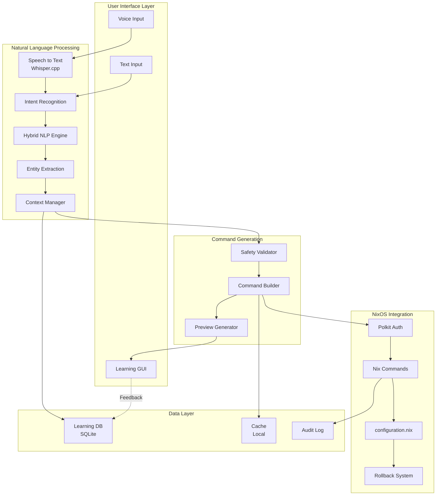
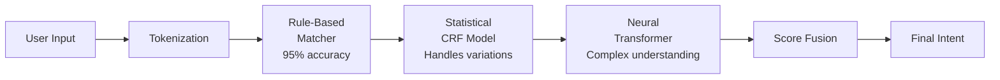
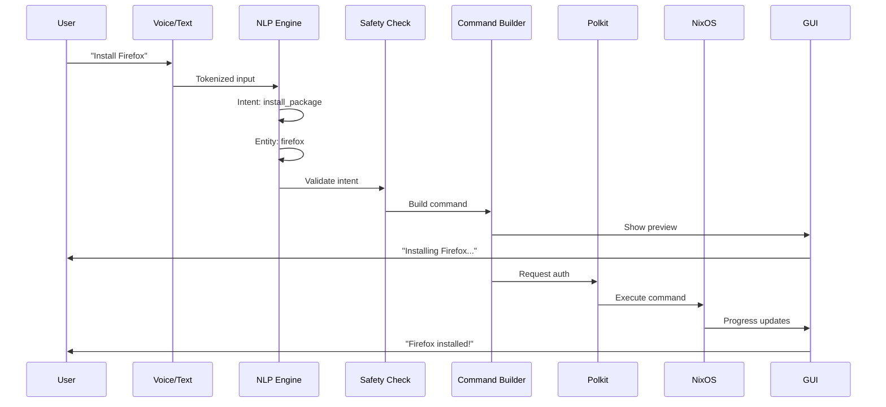
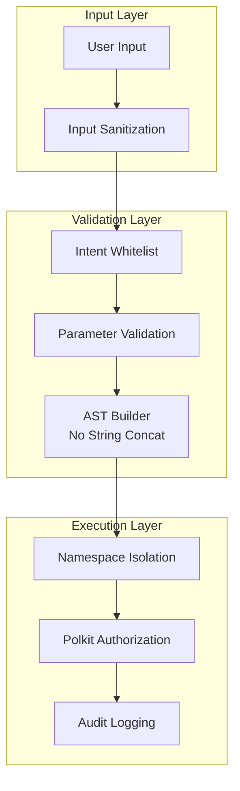
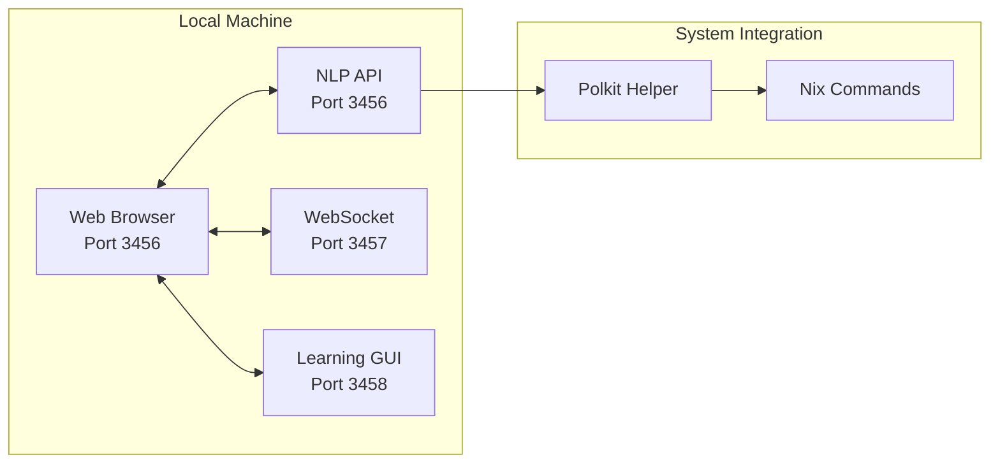
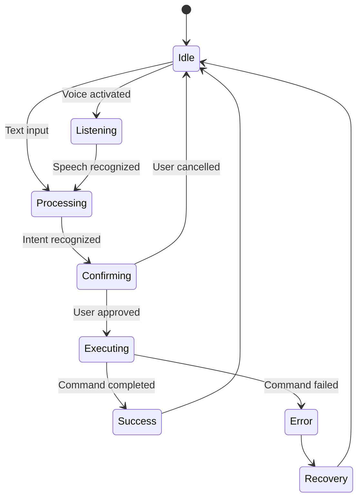

# 🏗️ System Architecture Diagram - Nix for Humanity

## High-Level Architecture



## Component Details

### 1. User Interface Layer
- **Voice Input**: Web Speech API + Whisper.cpp fallback
- **Text Input**: Natural language text box
- **Learning GUI**: Progressive interface (appears/fades based on mastery)

### 2. NLP Pipeline


### 3. Three-Layer NLP Architecture

#### Layer 1: Rule-Based (Fast Path)
```yaml
Common Commands:
  - Pattern: "install {package}"
  - Response Time: <10ms
  - Accuracy: 95%
  - Examples: 50+ patterns
```

#### Layer 2: Statistical (Variation Handler)
```yaml
Handles:
  - Typos: "instal fierfix"
  - Variations: "get me firefox"
  - Context: Pronouns, references
  - Response Time: <50ms
```

#### Layer 3: Neural (Complex Understanding)
```yaml
For:
  - Complex queries
  - Multi-step operations
  - Ambiguous requests
  - Response Time: <200ms
```

## Data Flow Architecture



## Security Architecture



## Deployment Architecture



## State Management



## Performance Architecture

### Response Time Targets
```
Voice Input → Response: <2s total
├── Speech Recognition: 500ms
├── NLP Processing: 100ms
├── Command Building: 50ms
├── UI Update: 50ms
└── Buffer: 300ms
```

### Resource Usage
```
Memory Usage: <400MB
├── NLP Models: 200MB
├── Voice Models: 140MB
├── Application: 50MB
└── Buffer: 10MB

CPU Usage: <25% average
├── Idle: <5%
├── Processing: 15-25%
└── Peak: 40%
```

## Scalability Considerations

### Current Scope (v1.0)
- Single user
- Local machine only
- 50+ intents
- English only

### Future Expansion (v2.0+)
- Multi-user (family)
- Network service option
- 200+ intents
- Multi-language

---

*Architecture designed for simplicity, security, and user sovereignty.*