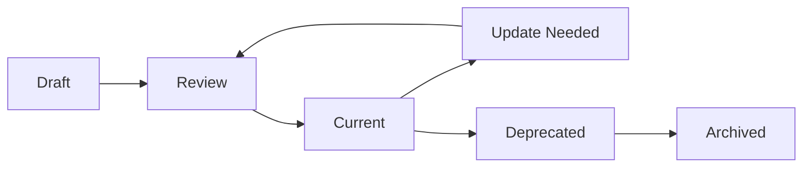

# 📚 Documentation Maintenance Plan - Nix for Humanity

## Current State Analysis

After reviewing our documentation archive, we've identified significant opportunities for improvement in organization, maintenance, and accessibility of our docs.

### Key Issues Found
1. **Heavy duplication** - Same documents exist in multiple locations
2. **Mixed organization** - Technical docs intermixed with philosophy, project management scattered
3. **Version confusion** - Multiple versions without clear indication of which is current
4. **Missing categories** - No examples, tutorials, or migration guides
5. **Inconsistent naming** - Mix of UPPERCASE, lowercase, kebab-case

## Proposed Documentation Structure

```
docs/
├── README.md                    # Documentation index & guide
├── CONTRIBUTING.md              # How to contribute
├── CODE_OF_CONDUCT.md          # Community standards
├── GLOSSARY.md                 # Technical terms explained
│
├── getting-started/            # New user entry point
│   ├── README.md              # Overview
│   ├── QUICKSTART.md          # 5-minute intro
│   ├── INSTALLATION.md        # Detailed setup
│   ├── FIRST_CONVERSATION.md  # First interaction guide
│   └── FAQ.md                 # Common questions
│
├── user-guide/                 # For end users
│   ├── README.md              # User guide overview
│   ├── NATURAL_LANGUAGE.md    # How to talk to the AI
│   ├── VOICE_SETUP.md         # Voice configuration
│   ├── LEARNING_SYSTEM.md     # How AI learns from you
│   ├── PRIVACY_CONTROL.md     # Managing your data
│   └── TROUBLESHOOTING.md     # When things go wrong
│
├── tutorials/                  # Step-by-step guides
│   ├── README.md              # Tutorial index
│   ├── basic/                 # Beginner tutorials
│   ├── intermediate/          # Advanced usage
│   └── examples/              # Example configurations
│
├── technical/                  # Developer documentation
│   ├── README.md              # Technical overview
│   ├── ARCHITECTURE.md        # System design
│   ├── API_REFERENCE.md       # API documentation
│   ├── NLP_ARCHITECTURE.md    # Language processing
│   ├── PLUGIN_DEVELOPMENT.md  # Extension guide
│   ├── SECURITY.md            # Security model
│   └── TESTING.md             # Testing approach
│
├── philosophy/                 # Vision & principles
│   ├── README.md              # Philosophy overview
│   ├── VISION.md              # Project vision
│   ├── PARTNERSHIP_PRINCIPLES.md
│   ├── CONSCIOUS_AI_DESIGN.md
│   ├── ETHICAL_BOUNDARIES.md
│   └── EVOLUTION_PATHWAY.md
│
├── operations/                 # Running in production
│   ├── README.md              # Operations overview
│   ├── DEPLOYMENT.md          # Deployment guide
│   ├── MONITORING.md          # System monitoring
│   ├── MAINTENANCE.md         # Maintenance tasks
│   ├── TROUBLESHOOTING.md     # Operational issues
│   └── EMERGENCY.md           # Emergency procedures
│
├── project/                    # Project management
│   ├── README.md              # Project overview
│   ├── ROADMAP.md             # Future plans
│   ├── CHANGELOG.md           # Version history
│   ├── STATUS.md              # Current status
│   └── DECISIONS/             # ADRs (Architecture Decision Records)
│
└── archive/                    # Old/deprecated docs
    └── README.md              # Explains archive
```

## Documentation Standards

### 1. File Naming Convention
- Use UPPERCASE for primary documents (README.md, CONTRIBUTING.md)
- Use lowercase with underscores for secondary docs (user_guide.md)
- Maintain consistency within each directory

### 2. Document Templates

#### Standard Document Header
```markdown
# 📚 [Document Title] - Nix for Humanity

> Brief one-line description of what this document covers

**Last Updated**: 2025-07-25
**Status**: Current/Draft/Deprecated
**Audience**: Users/Developers/Contributors

## Overview

Brief introduction to the document's purpose and contents.

## Table of Contents
- [Section 1](#section-1)
- [Section 2](#section-2)
```

#### Cross-Reference Footer
```markdown
## Related Documents
- [Related Doc 1](../path/to/doc1.md) - Brief description
- [Related Doc 2](../path/to/doc2.md) - Brief description

## Questions?
- **Users**: See our [FAQ](../getting-started/FAQ.md)
- **Developers**: Join our [Discord](https://discord.gg/luminous-dynamics)
- **Contributors**: Open a [GitHub Discussion](https://github.com/...)
```

### 3. Writing Style Guide

#### Tone and Voice
- **Conversational** - Write as if explaining to a friend
- **Inclusive** - Avoid jargon, explain technical terms
- **Partnership-focused** - Refer to AI as partner, not tool
- **Encouraging** - Frame challenges as opportunities

#### Language Patterns
```
❌ "Execute the command"
✅ "Ask your AI partner to"

❌ "The system will process"
✅ "Your AI partner understands"

❌ "Error: Invalid input"
✅ "I didn't understand that, could you rephrase?"
```

### 4. Documentation Lifecycle



Each document should have:
- **Status** tag in header
- **Last Updated** date
- **Review Schedule** (quarterly for user docs, monthly for technical)

## Maintenance Processes

### 1. Regular Review Cycle

**Weekly**:
- Update STATUS.md with current progress
- Review and update TROUBLESHOOTING.md with new issues
- Update CHANGELOG.md with releases

**Monthly**:
- Review all technical documentation for accuracy
- Update API_REFERENCE.md with changes
- Archive outdated documents

**Quarterly**:
- Full documentation audit
- User feedback integration
- Philosophy alignment check
- Reorganization if needed

### 2. Documentation Testing

```yaml
Documentation Tests:
  - Link checking (automated)
  - Code example validation
  - Screenshot updates
  - User journey testing
  - Accessibility review
```

### 3. Version Control

```bash
# Documentation branches
docs/update-[section]-[date]

# Commit messages for docs
docs: update user guide with new voice features
docs: fix broken links in API reference
docs: add tutorial for batch operations
```

## Missing Documentation to Create

### High Priority
1. **GLOSSARY.md** - Define all technical terms
2. **API_REFERENCE.md** - Complete API documentation
3. **TESTING_PHILOSOPHY.md** - How we test partnerships
4. **DEPLOYMENT.md** - Production deployment guide
5. **MIGRATION_GUIDE.md** - Upgrading between versions

### Medium Priority
1. **CONFIGURATION_EXAMPLES.md** - Sample configurations
2. **PERFORMANCE_TUNING.md** - Optimization guide
3. **BACKUP_RESTORE.md** - Data management
4. **INTEGRATION_GUIDE.md** - Third-party integrations
5. **METRICS_MONITORING.md** - What to track

### Low Priority
1. **CASE_STUDIES.md** - Real user stories
2. **COMPARISON.md** - vs traditional interfaces
3. **RESEARCH_NOTES.md** - Academic references
4. **FUTURE_VISION.md** - Long-term possibilities

## Documentation Tools

### 1. Documentation Generation
```bash
# Generate API docs from code
npm run docs:api

# Generate architecture diagrams
npm run docs:diagrams

# Check documentation health
npm run docs:check
```

### 2. Documentation Site
Consider setting up:
- Docusaurus or MkDocs for web presentation
- Search functionality
- Version switching
- Multi-language support

### 3. Documentation Metrics
Track:
- Page views (privacy-respecting)
- Search queries (what users look for)
- 404s (broken links)
- Feedback ratings

## Claude.md Memory Updates

### Essential Context to Add
```markdown
## 📚 Documentation Structure

Our documentation is organized into clear categories:
- `getting-started/` - New user onboarding
- `user-guide/` - End user documentation  
- `tutorials/` - Step-by-step guides
- `technical/` - Developer documentation
- `philosophy/` - Vision and principles
- `operations/` - Production/deployment
- `project/` - Project management

### Documentation Standards
- UPPERCASE for primary docs (README.md)
- Partnership-focused language
- Regular review cycles
- Clear status indicators

### Key Documents
@docs/README.md - Documentation index
@docs/getting-started/QUICKSTART.md - User entry point
@docs/technical/ARCHITECTURE.md - System design
@docs/philosophy/VISION.md - Project vision
@docs/project/STATUS.md - Current status
```

### Development Workflow Addition
```markdown
### Documentation Workflow
1. Update docs with every feature
2. Test all code examples
3. Review for partnership language
4. Check accessibility
5. Update related documents
6. Add to CHANGELOG.md
```

## Implementation Plan

### Phase 1: Organization (Week 1)
1. Create new directory structure
2. Move documents to appropriate locations
3. Remove duplicates (keep best version)
4. Update all internal links
5. Create comprehensive README.md index

### Phase 2: Gap Filling (Week 2)
1. Write missing high-priority documents
2. Update outdated documents
3. Add examples and tutorials
4. Improve troubleshooting guides

### Phase 3: Automation (Week 3)
1. Set up documentation generation
2. Add link checking to CI
3. Create documentation templates
4. Set up review reminders

### Phase 4: Enhancement (Week 4)
1. Add diagrams and visualizations
2. Create video documentation
3. Set up documentation site
4. Gather user feedback

## Success Metrics

### Quantitative
- 90% of links working
- All code examples tested
- Documentation for all features
- Monthly review compliance

### Qualitative
- Users find answers quickly
- Developers contribute easily
- Documentation feels cohesive
- Partnership vision clear throughout

## Maintenance Checklist

### For Every Feature
- [ ] Update relevant user guide
- [ ] Add to API reference
- [ ] Create/update tutorial
- [ ] Update troubleshooting
- [ ] Add to changelog
- [ ] Test all examples

### For Every Release
- [ ] Update STATUS.md
- [ ] Update ROADMAP.md
- [ ] Review all quickstarts
- [ ] Check for broken links
- [ ] Archive outdated docs
- [ ] Announce changes

---

**Remember**: Documentation is a living partnership between writers and readers. Keep it alive, keep it current, keep it human.

*"The best documentation is like a good conversation - clear, helpful, and leaves you feeling capable."*