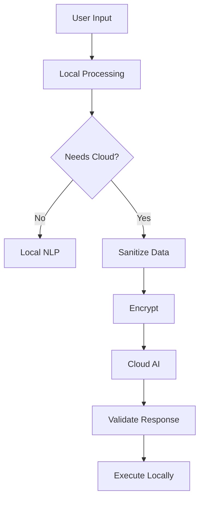

# ☁️ Cloud AI Integration - Nix for Humanity

> Optional cloud AI services for enhanced capabilities while maintaining privacy by default

## Philosophy: Local First, Cloud Optional

Nix for Humanity operates fully offline by default, but users can **optionally** enable cloud AI services for:
- More sophisticated natural language understanding
- Multi-language support
- Advanced troubleshooting assistance
- Learning from global patterns (anonymized)

## Supported Cloud AI Services

### 1. Claude (Anthropic)
**Best for**: Nuanced understanding, complex system reasoning, ethical AI

**Capabilities Enabled**:
- **Advanced Troubleshooting**: "My system won't boot after update" → Detailed diagnostic steps
- **Complex Configurations**: "Set up a development environment for Rust with cross-compilation"
- **Learning Assistant**: Explains what each command does and why
- **Safety Analysis**: Warns about potentially dangerous operations

**Integration**:
```javascript
// .env.local (user-controlled)
CLAUDE_API_KEY=your-api-key
CLAUDE_MODEL=claude-3-opus-20240229  // or claude-3-sonnet for faster/cheaper

// Usage
const claude = new ClaudeIntegration({
  apiKey: process.env.CLAUDE_API_KEY,
  model: process.env.CLAUDE_MODEL,
  maxTokens: 1000,
  temperature: 0.3  // More deterministic for system commands
});
```

### 2. Gemini (Google)
**Best for**: Multi-modal understanding, fast responses, broad knowledge

**Capabilities Enabled**:
- **Screenshot Analysis**: Show error screenshot → Get solution
- **Voice in Multiple Languages**: Speak in any language
- **Package Recommendations**: "I need something for photo editing" → Contextual suggestions
- **Real-time Assistance**: Very fast response times

**Integration**:
```javascript
// .env.local
GEMINI_API_KEY=your-api-key
GEMINI_MODEL=gemini-pro

// Usage
const gemini = new GeminiIntegration({
  apiKey: process.env.GEMINI_API_KEY,
  model: process.env.GEMINI_MODEL,
  safetySettings: 'strict'  // Important for system commands
});
```

### 3. OpenAI (ChatGPT)
**Best for**: General understanding, wide deployment, plugins ecosystem

**Capabilities Enabled**:
- **Natural Conversations**: More conversational command building
- **Code Generation**: "Create a systemd service for my app"
- **Error Explanation**: Detailed explanations of error messages
- **Custom Functions**: Can call NixOS-specific functions

**Integration**:
```javascript
// .env.local
OPENAI_API_KEY=your-api-key
OPENAI_MODEL=gpt-4-turbo  // or gpt-3.5-turbo for budget

// Usage
const openai = new OpenAIIntegration({
  apiKey: process.env.OPENAI_API_KEY,
  model: process.env.OPENAI_MODEL,
  functions: nixosFunctions  // Custom NixOS operations
});
```

### 4. Local LLMs via Ollama (Self-Hosted)
**Best for**: Complete privacy, no internet required, customizable

**Capabilities Enabled**:
- **Privacy-First**: All processing on your machine
- **Customized Models**: Fine-tuned for NixOS
- **No Rate Limits**: Use as much as you want
- **Offline Operation**: Works without internet

**Integration**:
```javascript
// .env.local
OLLAMA_HOST=http://localhost:11434
OLLAMA_MODEL=mixtral:8x7b  // or llama2, mistral, etc.

// Usage
const ollama = new OllamaIntegration({
  host: process.env.OLLAMA_HOST,
  model: process.env.OLLAMA_MODEL,
  stream: true  // Real-time responses
});
```

## Enhanced Capabilities with Cloud AI

### 1. Intelligent Troubleshooting
```yaml
User: "My WiFi keeps disconnecting"

Local Only: Basic diagnostic steps
With Cloud AI: 
  - Analyzes system logs
  - Identifies patterns
  - Suggests specific driver fixes
  - Recommends configuration changes
  - Provides hardware-specific solutions
```

### 2. Complex System Design
```yaml
User: "Set up a home media server with automated downloads"

Local Only: Install basic packages
With Cloud AI:
  - Complete architecture design
  - Security considerations
  - Automated configuration generation
  - Integration with existing services
  - Performance optimization tips
```

### 3. Learning & Education
```yaml
User: "Teach me about systemd"

Local Only: Basic command reference
With Cloud AI:
  - Interactive tutorials
  - Progressive exercises
  - Real-world examples
  - Best practices
  - Common pitfalls to avoid
```

### 4. Multi-Language Support
```yaml
User: "Instalar Firefox" (Spanish)

Local Only: English only
With Cloud AI:
  - Understands 100+ languages
  - Responds in user's language
  - Culturally appropriate explanations
```

## Privacy & Security Architecture

### Data Flow with Cloud AI


### Privacy Protections
1. **Opt-in Only**: No cloud services without explicit consent
2. **Data Minimization**: Only send necessary context
3. **No System Info**: Never send passwords, keys, or personal data
4. **Local Execution**: All commands run locally after validation
5. **Audit Trail**: Log what was sent to cloud (not the response)

### Security Measures
```javascript
// Data sanitization before cloud transmission
function sanitizeForCloud(input) {
  return input
    .replace(/\/home\/\w+/g, '/home/user')  // Remove usernames
    .replace(/\b(?:\d{1,3}\.){3}\d{1,3}\b/g, 'x.x.x.x')  // Remove IPs
    .replace(/[a-zA-Z0-9._%+-]+@[a-zA-Z0-9.-]+\.[a-zA-Z]{2,}/g, 'email@hidden')  // Remove emails
    .replace(/(?:password|passwd|pwd|secret|key)[\s]*[:=][\s]*\S+/gi, 'password=***');  // Remove secrets
}
```

## Configuration

### Enabling Cloud AI
```bash
# 1. Install cloud AI plugin
nix-for-humanity install-plugin cloud-ai

# 2. Configure your preferred service
nix-for-humanity configure cloud-ai

# 3. Choose service and enter API key (stored encrypted)
> Which service? [claude/gemini/openai/ollama]: claude
> API Key: **********************
> Enable for complex queries only? [Y/n]: Y

# 4. Test connection
nix-for-humanity test cloud-ai
```

### Per-Query Control
```bash
# Force local processing
nix-for-humanity --local "install firefox"

# Request cloud assistance
nix-for-humanity --cloud "help me set up a development environment"

# Auto mode (default) - uses cloud only when beneficial
nix-for-humanity "configure nginx with SSL"
```

## Implementation Architecture

```typescript
interface CloudAIProvider {
  name: string;
  capabilities: string[];
  processQuery(query: ProcessedIntent): Promise<EnhancedResponse>;
  isAvailable(): boolean;
  estimateCost(query: string): number;
}

class CloudAIManager {
  providers: Map<string, CloudAIProvider>;
  
  async enhance(query: ProcessedIntent): Promise<EnhancedResponse> {
    // Check if cloud is needed/wanted
    if (!this.shouldUseCloud(query)) {
      return null;
    }
    
    // Sanitize data
    const sanitized = this.sanitize(query);
    
    // Select best provider for query type
    const provider = this.selectProvider(query.type);
    
    // Get enhanced response
    const enhanced = await provider.processQuery(sanitized);
    
    // Validate before returning
    return this.validate(enhanced);
  }
}
```

## Cost Considerations

### Estimated Monthly Costs (Average User)
- **Claude**: $5-20/month (Complex queries only)
- **Gemini**: $0-10/month (Generous free tier)
- **GPT-4**: $10-30/month (Depends on usage)
- **Ollama**: $0 (Self-hosted)

### Cost Optimization
```javascript
// Intelligent routing to minimize costs
if (query.complexity === 'simple') {
  return processLocally(query);
} else if (query.requiresLatestInfo) {
  return useGemini(query);  // Good for current information
} else if (query.requiresDeepReasoning) {
  return useClaude(query);  // Best for complex logic
} else {
  return useGPT35(query);  // Good balance of cost/capability
}
```

## Future Enhancements

### Planned Features
1. **Hybrid Processing**: Use cloud to enhance local models
2. **Federated Learning**: Improve local models from anonymized cloud insights
3. **Custom Fine-Tuning**: Train models on your specific usage patterns
4. **Multi-Provider Consensus**: Ask multiple AIs for critical operations

### Community Features
1. **Shared Knowledge Base**: Optional community patterns (anonymized)
2. **Expert Assistance**: Connect with human experts through AI
3. **Template Library**: Cloud-enhanced configuration templates

## Ethical Considerations

1. **User Control**: Always respect user's choice to stay local
2. **Transparency**: Clear indication when cloud is being used
3. **Data Rights**: Users own their data and can delete it
4. **No Lock-in**: Can switch providers or go fully local anytime
5. **Environmental**: Consider carbon footprint of cloud AI usage

---

*Cloud AI is a powerful tool, but local processing remains our foundation. Privacy first, enhancement optional.*