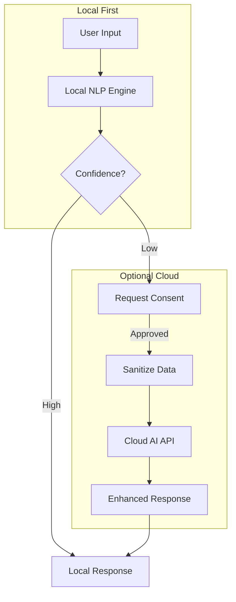

# 🌩️ Cloud AI Integration Guide - Nix for Humanity

> **Important**: This is an OPTIONAL feature. Nix for Humanity is designed to work completely offline with local processing. Cloud AI should only enhance, never replace, local functionality.

## Philosophy

Cloud AI integration in Nix for Humanity follows these principles:

1. **Privacy First**: All cloud features are opt-in with clear consent
2. **Local Fallback**: System must work perfectly without cloud
3. **Data Minimization**: Send only what's absolutely necessary
4. **User Control**: Easy to disable, data deletion on demand
5. **Transparency**: Show exactly what's sent and why

## Recommended Cloud AI Services

### 1. **Privacy-Focused Options** (Recommended)

#### Anthropic Claude API
- **Why**: Strong privacy commitments, no training on user data
- **Use Case**: Complex multi-step NixOS configurations
- **Integration**: Fallback for queries local NLP can't handle

```javascript
// Only use for complex queries after user consent
if (complexity > LOCAL_THRESHOLD && userConsent) {
  const response = await claudeAPI.complete({
    prompt: sanitizedQuery,
    max_tokens: 150
  });
}
```

#### Ollama (Self-Hosted)
- **Why**: Run your own AI models
- **Use Case**: Enhanced NLP without leaving your network
- **Integration**: Bridge between local and "cloud" (your server)

```javascript
// Connect to your own Ollama instance
const ollama = new Ollama({ 
  host: userConfig.ollamaHost || 'localhost:11434' 
});
```

### 2. **General Purpose Options** (Use Cautiously)

#### OpenAI API
- **Pros**: Powerful GPT-4 for complex understanding
- **Cons**: Privacy concerns, expensive
- **Use Case**: Advanced troubleshooting assistance

#### Hugging Face Inference API
- **Pros**: Many open models, reasonable privacy
- **Cons**: Variable quality
- **Use Case**: Specialized NLP tasks

### 3. **Voice-Specific Options**

#### Deepgram
- **Pros**: Fast, accurate transcription
- **Cons**: Requires audio upload
- **Use Case**: When Whisper.cpp struggles with accents

## Implementation Architecture



## Privacy-Preserving Implementation

### 1. Configuration Schema

```javascript
// config/cloud-ai.js
export const cloudAIConfig = {
  enabled: false,  // Default OFF
  provider: null,  // 'anthropic' | 'openai' | 'ollama' | null
  
  // Privacy settings
  privacy: {
    stripPersonalInfo: true,
    anonymizePackageNames: false,
    localCacheResponses: true,
    dataRetention: '24h',  // Auto-delete after
    sendAnalytics: false
  },
  
  // Consent management
  consent: {
    required: true,
    rememberChoice: false,
    expiresAfter: '7d'
  },
  
  // Fallback behavior
  fallback: {
    useLocalOnly: true,
    showCloudOption: true,
    explainLimitations: true
  }
};
```

### 2. Data Sanitization

```javascript
class PrivacyPreservingSanitizer {
  sanitize(query, context) {
    let sanitized = query;
    
    // Remove personal paths
    sanitized = sanitized.replace(/\/home\/\w+/g, '/home/user');
    
    // Remove IP addresses
    sanitized = sanitized.replace(/\b\d{1,3}\.\d{1,3}\.\d{1,3}\.\d{1,3}\b/g, 'xxx.xxx.xxx.xxx');
    
    // Remove email addresses
    sanitized = sanitized.replace(/[\w.-]+@[\w.-]+\.\w+/g, 'user@example.com');
    
    // Generalize system-specific info
    sanitized = this.generalizeSystemInfo(sanitized);
    
    return {
      original: query,
      sanitized: sanitized,
      removed: this.getDiff(query, sanitized)
    };
  }
}
```

### 3. Consent UI

```javascript
class CloudAIConsent {
  async requestConsent(reason, dataToSend) {
    return await showModal({
      title: 'Enhanced AI Assistance Available',
      message: `
        Your query might benefit from cloud AI assistance.
        
        Reason: ${reason}
        
        Data to send (sanitized):
        ${dataToSend.sanitized}
        
        Removed for privacy:
        ${dataToSend.removed.join(', ')}
      `,
      buttons: [
        { text: 'Use Local Only', value: false, default: true },
        { text: 'Allow This Time', value: 'once' },
        { text: 'Allow for Session', value: 'session' }
      ]
    });
  }
}
```

### 4. Integration Layer

```javascript
class CloudAIIntegration {
  constructor(config) {
    this.config = config;
    this.sanitizer = new PrivacyPreservingSanitizer();
    this.consent = new CloudAIConsent();
  }
  
  async enhance(query, localResult) {
    // Only consider cloud if local confidence is low
    if (localResult.confidence > 0.8) {
      return localResult;
    }
    
    // Check if cloud is enabled
    if (!this.config.enabled) {
      return this.explainLocalLimitation(localResult);
    }
    
    // Get consent
    const consent = await this.consent.requestConsent(
      'Complex query detected',
      this.sanitizer.sanitize(query)
    );
    
    if (!consent) {
      return localResult;
    }
    
    // Use cloud API
    try {
      const enhanced = await this.callCloudAPI(query);
      return this.mergeResults(localResult, enhanced);
    } catch (error) {
      console.error('Cloud AI failed, using local result', error);
      return localResult;
    }
  }
}
```

## Security Considerations

### API Key Management
```nix
# Store API keys in NixOS secrets
{ config, pkgs, ... }:
{
  age.secrets.anthropic-api-key = {
    file = ./secrets/anthropic-key.age;
    owner = "nix-for-humanity";
    group = "users";
    mode = "0400";
  };
  
  systemd.services.nix-for-humanity.environment = {
    ANTHROPIC_API_KEY_FILE = config.age.secrets.anthropic-api-key.path;
  };
}
```

### Rate Limiting
```javascript
const rateLimiter = {
  maxRequestsPerHour: 100,
  maxRequestsPerDay: 1000,
  costBudgetPerMonth: 20.00  // $20 max
};
```

## User Interface

### Settings Page
```
Cloud AI Enhancement (Optional)
━━━━━━━━━━━━━━━━━━━━━━━━━━━━━
[ ] Enable cloud AI assistance
    ⚠️ Requires internet connection
    🔒 Your data is sanitized before sending

Provider: [Anthropic Claude ▼]
- Anthropic Claude (Recommended - Privacy focused)
- OpenAI GPT-4 (Powerful but less private)  
- Ollama (Self-hosted)
- None

Privacy Level: [Maximum ▼]
- Maximum: Strip all personal info
- Balanced: Keep package names
- Minimal: Only remove passwords

Data Retention: [24 hours ▼]

[Test Connection] [View Privacy Policy]
```

## Monitoring & Transparency

### Usage Dashboard
```
Cloud AI Usage This Month
━━━━━━━━━━━━━━━━━━━━━━━━
Requests: 47 / 1000
Cost: $3.21 / $20.00
Data sent: 142 KB

Recent Queries:
- "Configure complex networking" (sanitized)
- "Troubleshoot boot issues" (sanitized)
- "Optimize system performance" (sanitized)

[Download My Data] [Delete Cloud History]
```

## Best Practices

1. **Progressive Enhancement**
   - Start with local-only
   - Add cloud only when truly beneficial
   - Always maintain local fallback

2. **Clear Communication**
   - Tell users when cloud would help
   - Show exactly what data would be sent
   - Explain the benefits clearly

3. **Respect User Choice**
   - Default to privacy
   - Make opting out easy
   - Don't nag about cloud features

4. **Cost Management**
   - Set spending limits
   - Use free tiers wisely
   - Cache cloud responses locally

## Testing Cloud Integration

```javascript
describe('Cloud AI Integration', () => {
  it('should work perfectly with cloud disabled', () => {
    config.cloud.enabled = false;
    const result = nlp.process('install firefox');
    expect(result.source).toBe('local');
    expect(result.success).toBe(true);
  });
  
  it('should sanitize data before sending', () => {
    const sanitized = sanitizer.sanitize('install firefox in /home/john');
    expect(sanitized).not.toContain('john');
    expect(sanitized).toContain('/home/user');
  });
  
  it('should respect user consent', async () => {
    const spy = jest.spyOn(cloudAPI, 'call');
    userConsent.mockReturnValue(false);
    
    await nlp.process('complex query');
    expect(spy).not.toHaveBeenCalled();
  });
});
```

## Conclusion

Cloud AI can enhance Nix for Humanity, but must:
- Never compromise privacy
- Always be optional
- Provide clear value
- Respect user sovereignty

Remember: The best AI is the one that respects human agency.

---

*"Local first, cloud when needed, privacy always."*