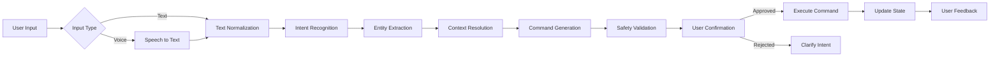

# 🔄 Data Flow Specification - Nix for Humanity

## Overview

This document describes how data flows through the Nix for Humanity system from user input to system action.

## High-Level Data Flow



## Detailed Data Flow

### 1. Input Processing Flow

#### Voice Input Path
```yaml
Voice Input:
  1. Audio Capture:
     - Format: 16kHz, mono, PCM
     - Duration: Max 30 seconds
     - Size: ~1MB per utterance
     
  2. Speech Recognition:
     - Processor: Whisper.cpp (local)
     - Model: base.en (140MB)
     - Output: Text transcript
     - Confidence: 0.0-1.0
     
  3. Audio Cleanup:
     - Audio buffer cleared
     - No persistence
     - Memory freed
```

#### Text Input Path
```yaml
Text Input:
  1. Character Entry:
     - Max length: 500 chars
     - Encoding: UTF-8
     - Validation: XSS prevention
     
  2. Normalization:
     - Lowercase conversion
     - Punctuation handling
     - Whitespace normalization
     
  3. Sanitization:
     - Remove control chars
     - Escape special chars
     - Validate length
```

### 2. NLP Processing Flow

```typescript
interface NLPDataFlow {
  // Input from user
  rawInput: string;
  
  // After normalization
  normalizedInput: string;
  
  // After intent recognition
  intent: {
    name: string;
    confidence: number;
    matchedPattern: string;
  };
  
  // After entity extraction
  entities: {
    [key: string]: {
      value: string;
      type: string;
      confidence: number;
    };
  };
  
  // After context resolution
  resolvedQuery: {
    intent: Intent;
    entities: Entity[];
    context: Context;
  };
}
```

#### Processing Pipeline
```yaml
1. Tokenization:
   Input: "install firefox please"
   Output: ["install", "firefox", "please"]
   
2. Intent Matching:
   Tokens: ["install", "firefox", "please"]
   Patterns: Check against 50+ patterns
   Match: "install_package" (confidence: 0.98)
   
3. Entity Extraction:
   Tokens: ["install", "firefox", "please"]
   Entities: {package: "firefox"}
   
4. Context Integration:
   Previous: null
   Current: {intent: "install_package", package: "firefox"}
   Resolved: Same (no pronouns)
```

### 3. Command Generation Flow

```typescript
interface CommandFlow {
  // Input from NLP
  intent: ProcessedIntent;
  
  // Generated command
  nixCommand: {
    type: 'query' | 'modify' | 'info';
    action: string;
    parameters: string[];
    requiresAuth: boolean;
  };
  
  // Safety check result
  validation: {
    safe: boolean;
    warnings: string[];
    requiresConfirmation: boolean;
  };
  
  // Final command
  executableCommand: string;
}
```

#### Command Building Process
```yaml
1. Intent to Action Mapping:
   install_package -> nix.addPackage()
   remove_package -> nix.removePackage()
   update_system -> nix.updateSystem()
   
2. Parameter Resolution:
   package: "firefox" -> "nixpkgs.firefox"
   service: "nginx" -> "services.nginx"
   
3. Command Construction:
   Action: addPackage
   Param: "nixpkgs.firefox"
   Command: Generate AST, not string
   
4. Safety Validation:
   - No shell execution
   - No path traversal
   - No privilege escalation
   - Package exists check
```

### 4. State Management Flow

```typescript
interface StateFlow {
  // User session state
  session: {
    id: string;
    startTime: Date;
    intents: Intent[];
    context: Context;
  };
  
  // System state
  system: {
    generation: number;
    packages: string[];
    services: string[];
    lastModified: Date;
  };
  
  // Learning state
  learning: {
    patterns: Map<string, number>;
    corrections: Correction[];
    confidence: number;
  };
}
```

#### State Updates
```yaml
Before Command:
  - Snapshot current state
  - Create rollback point
  - Lock for modification

During Command:
  - Track progress
  - Update UI state
  - Maintain context

After Command:
  - Update system state
  - Record in history
  - Clear rollback point
  - Update learning data
```

### 5. Feedback Loop Flow

```yaml
User Feedback:
  1. Implicit Feedback:
     - Command succeeded/failed
     - User corrected intent
     - User cancelled action
     
  2. Pattern Learning:
     - New phrase -> intent mapping
     - Confidence adjustment
     - Context patterns
     
  3. Storage:
     - Local SQLite database
     - Encrypted at rest
     - 90-day retention
     - User can purge anytime
```

## Data Storage Specifications

### 1. Temporary Storage (Memory)
```typescript
// Session data - cleared on exit
interface SessionStorage {
  currentIntent: Intent | null;
  context: Context;
  audioBuffer: ArrayBuffer | null;
  confirmationPending: boolean;
}
```

### 2. Persistent Storage (SQLite)
```sql
-- Intent patterns table
CREATE TABLE patterns (
  id INTEGER PRIMARY KEY,
  pattern TEXT NOT NULL,
  intent TEXT NOT NULL,
  success_count INTEGER DEFAULT 0,
  fail_count INTEGER DEFAULT 0,
  last_used TIMESTAMP,
  user_added BOOLEAN DEFAULT FALSE
);

-- User corrections table
CREATE TABLE corrections (
  id INTEGER PRIMARY KEY,
  original_input TEXT,
  interpreted_intent TEXT,
  correct_intent TEXT,
  timestamp TIMESTAMP,
  applied BOOLEAN DEFAULT FALSE
);

-- Audit log table
CREATE TABLE audit_log (
  id INTEGER PRIMARY KEY,
  timestamp TIMESTAMP NOT NULL,
  action TEXT NOT NULL,
  parameters TEXT,
  result TEXT,
  rollback_available BOOLEAN
);
```

### 3. Cache Storage
```yaml
Cache Layers:
  L1 - Memory Cache:
    - Recent intents (last 100)
    - Common packages list
    - Active context
    - Size: ~10MB
    
  L2 - Disk Cache:
    - Package search index
    - Intent patterns
    - Model data
    - Size: ~200MB
    
  L3 - System Cache:
    - Nix store paths
    - Service states
    - Configuration
    - Size: Variable
```

## Security Considerations

### Data in Transit
```yaml
Internal Communication:
  - All IPC encrypted
  - No network transmission
  - Memory-only for sensitive data
  
WebSocket (Local Only):
  - localhost only
  - No external connections
  - TLS optional for local
```

### Data at Rest
```yaml
Encryption:
  - SQLite: Encrypted with SQLCipher
  - Logs: No sensitive data logged
  - Audio: Never persisted
  - Commands: Sanitized before storage
```

### Data Retention
```yaml
Retention Policies:
  - Session data: Until exit
  - Audio data: Never stored
  - Intent history: 90 days
  - Corrections: 90 days
  - Audit log: 1 year
  - User can purge: Anytime
```

## Performance Specifications

### Latency Targets
```yaml
Input Processing:
  - Voice to text: <500ms
  - Text normalization: <10ms
  
NLP Processing:
  - Intent recognition: <50ms
  - Entity extraction: <30ms
  - Context resolution: <20ms
  
Command Generation:
  - Build command: <50ms
  - Validate safety: <100ms
  
Total Target: <1000ms
```

### Throughput Targets
```yaml
Concurrent Users: 1 (local only)
Requests/Second: 10
Audio Processing: 1 stream
Memory Usage: <400MB
CPU Usage: <25% average
```

## Error Handling Flow

```yaml
Error Categories:
  1. Input Errors:
     - No audio input
     - Unrecognized speech
     - Invalid text
     Flow: Request clarification
     
  2. NLP Errors:
     - No intent matched
     - Low confidence
     - Ambiguous input
     Flow: Suggest alternatives
     
  3. System Errors:
     - Package not found
     - Permission denied
     - Network unavailable
     Flow: Explain and suggest
     
  4. Critical Errors:
     - Security violation
     - System corruption
     - Out of resources
     Flow: Safe mode, rollback
```

## Monitoring Points

```yaml
Metrics Collection:
  1. Input Metrics:
     - Input type distribution
     - Recognition accuracy
     - Processing time
     
  2. NLP Metrics:
     - Intent recognition rate
     - Entity extraction accuracy
     - Context resolution success
     
  3. System Metrics:
     - Command success rate
     - Rollback frequency
     - Error distribution
     
  4. Performance Metrics:
     - Response times
     - Memory usage
     - CPU utilization
```

---

*Data flows like water - it should move smoothly, purposefully, and leave no trace when it's done.*