# 🗺️ User Journey Diagram - Nix for Humanity

## The Three-Stage Journey

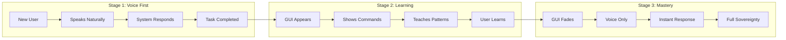

## Persona Journeys

### 🌹 Grandma Rose's Journey (75, Non-technical)

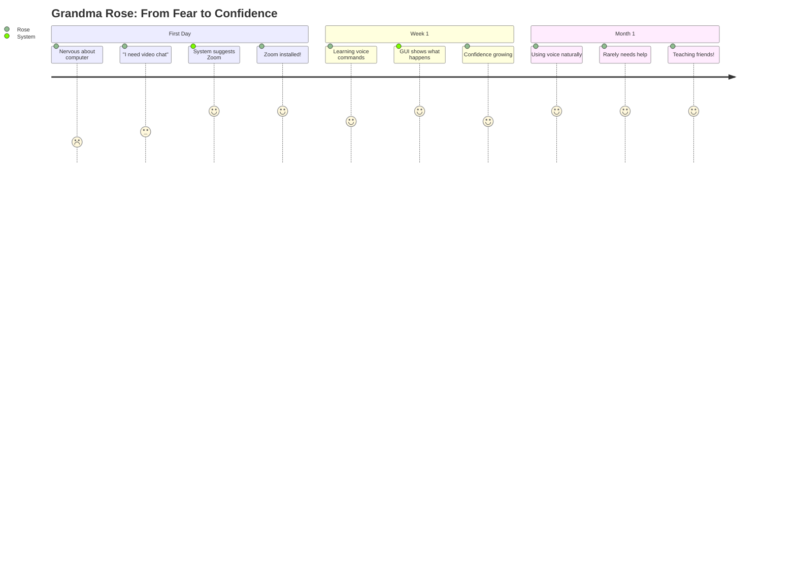

### 🎮 Maya's Journey (16, ADHD Tech-savvy)

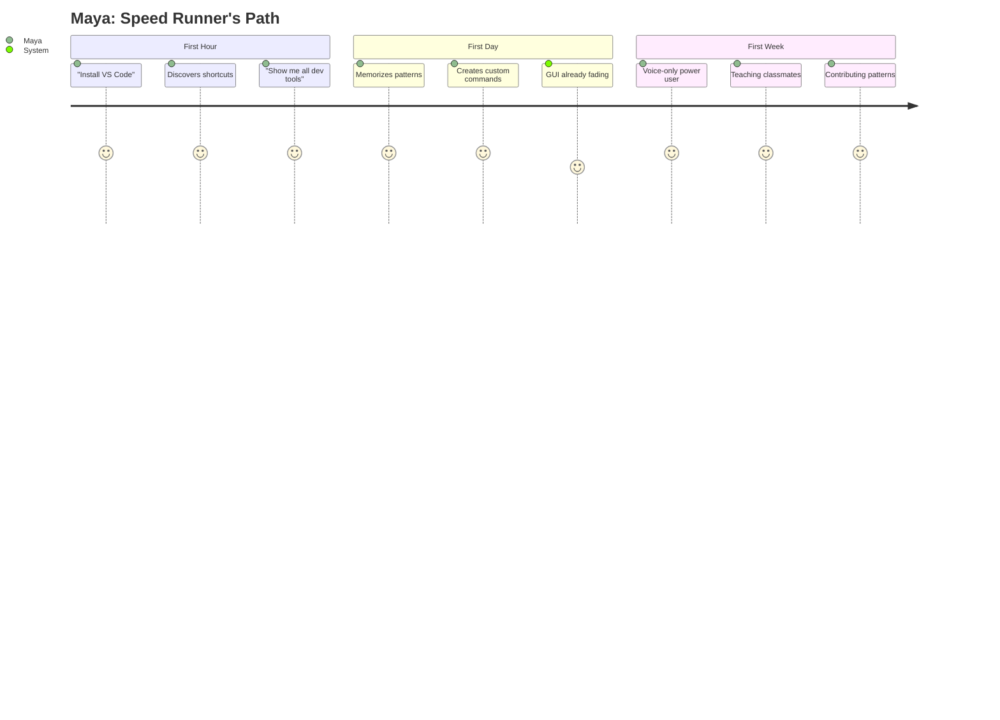

### 💼 David's Journey (42, Busy Parent)

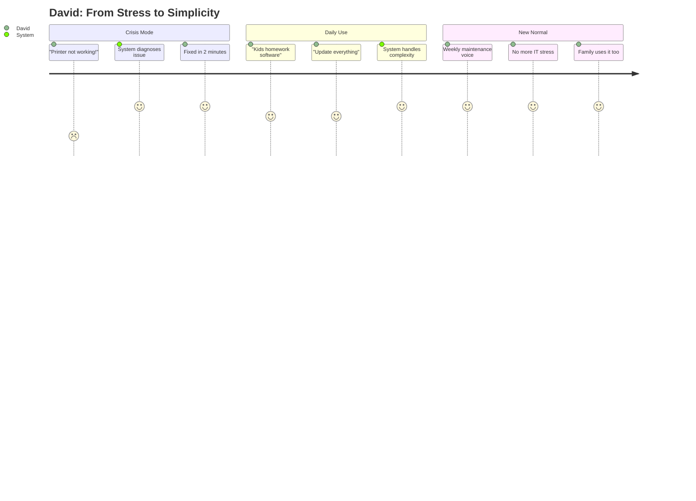

## Onboarding Flow

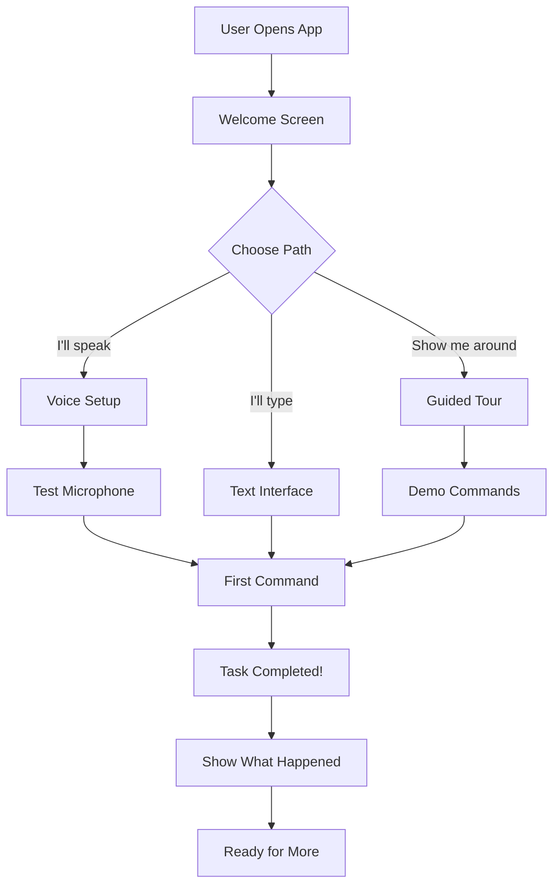

## Learning Progression

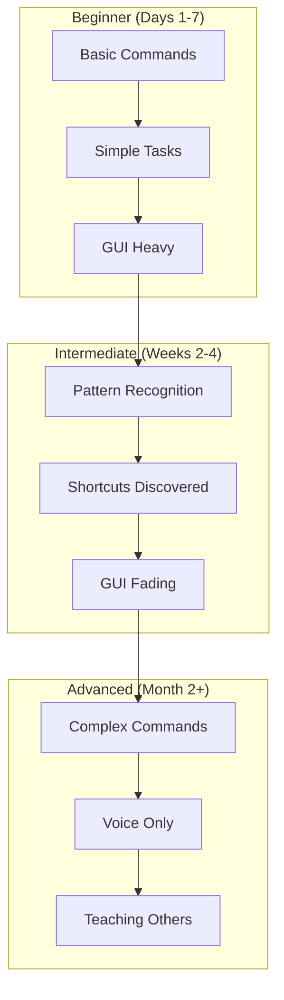

## Error Recovery Journey

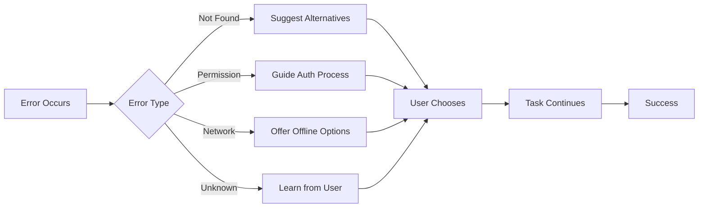

## Daily Usage Patterns

```mermaid
gantt
    title Typical Day with Nix for Humanity
    dateFormat HH:mm
    axisFormat %H:%M
    
    section Morning
    Check updates     :08:00, 5m
    Install work apps :08:05, 10m
    
    section Work Day
    Quick configs     :10:00, 5m
    Dev environment   :14:00, 10m
    
    section Evening
    Kids homework app :18:00, 5m
    System cleanup    :21:00, 5m
```

## Emotional Journey Map

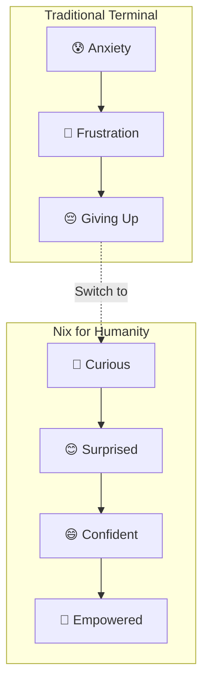

## Feature Discovery Path

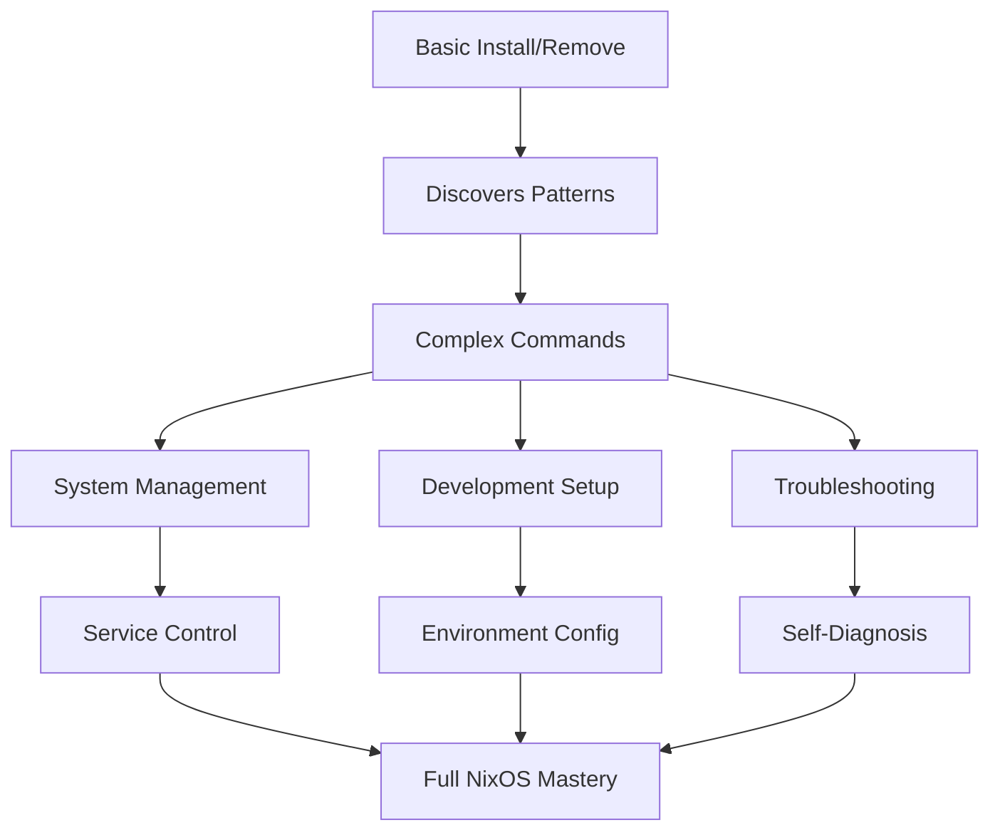

## Support Journey

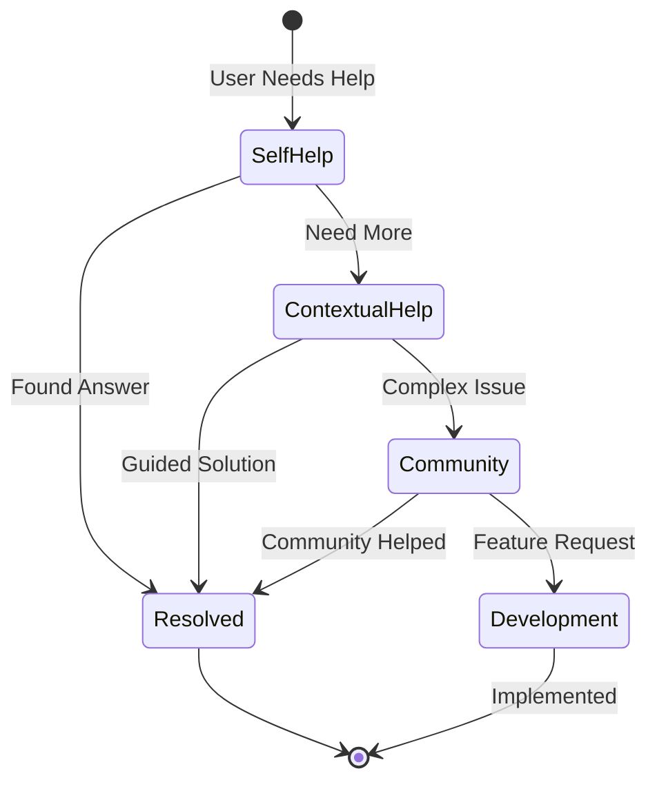

## Success Metrics Journey

```
Week 1: First Success
├── Installed first package ✓
├── Used voice command ✓
└── Felt confident ✓

Month 1: Building Mastery
├── Daily voice use ✓
├── GUI rarely needed ✓
├── Helping others ✓
└── Suggesting improvements ✓

Month 3: Full Sovereignty
├── Complex operations easy ✓
├── Teaching family ✓
├── Contributing patterns ✓
└── NixOS expert! ✓
```

---

*Every journey begins with a single voice command: "Help me."*