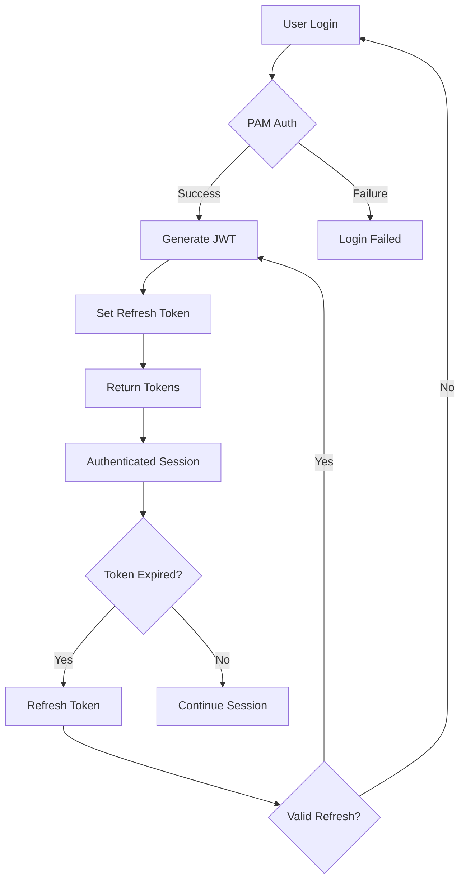

# NixOS GUI Security Guide

## Table of Contents

1. [Security Overview](#security-overview)
2. [Threat Model](#threat-model)
3. [Security Features](#security-features)
4. [Authentication & Authorization](#authentication--authorization)
5. [Network Security](#network-security)
6. [System Security](#system-security)
7. [Data Protection](#data-protection)
8. [Audit & Compliance](#audit--compliance)
9. [Security Best Practices](#security-best-practices)
10. [Incident Response](#incident-response)

## Security Overview

NixOS GUI implements defense-in-depth security with multiple layers of protection. This guide details the security architecture, features, and best practices for secure deployment and operation.

### Security Principles

1. **Principle of Least Privilege**: Minimal permissions required
2. **Defense in Depth**: Multiple security layers
3. **Secure by Default**: Safe default configurations
4. **Transparency**: Clear security boundaries
5. **Auditability**: Comprehensive logging

### Security Architecture

```
┌─────────────────────────────────────────────────┐
│              Security Layers                     │
├─────────────────────────────────────────────────┤
│ 1. Network Security (TLS, Firewall, Rate Limit) │
├─────────────────────────────────────────────────┤
│ 2. Application Security (Auth, Validation)       │
├─────────────────────────────────────────────────┤
│ 3. System Security (Privilege Separation)        │
├─────────────────────────────────────────────────┤
│ 4. Data Security (Encryption, Access Control)    │
├─────────────────────────────────────────────────┤
│ 5. Monitoring (Audit Logs, Intrusion Detection)  │
└─────────────────────────────────────────────────┘
```

## Threat Model

### Identified Threats

1. **External Threats**
   - Unauthorized access attempts
   - Brute force attacks
   - Cross-site scripting (XSS)
   - Cross-site request forgery (CSRF)
   - SQL injection
   - Denial of service (DoS)

2. **Internal Threats**
   - Privilege escalation
   - Unauthorized configuration changes
   - Data exfiltration
   - Malicious packages

3. **System Threats**
   - Supply chain attacks
   - Dependency vulnerabilities
   - Configuration errors
   - Resource exhaustion

### Attack Vectors

- **Network**: Open ports, unencrypted traffic
- **Authentication**: Weak passwords, session hijacking
- **Application**: Input validation, injection attacks
- **System**: Privileged operations, file access

## Security Features

### Built-in Protections

1. **Authentication**
   - PAM integration for system auth
   - JWT tokens with expiration
   - Refresh token rotation
   - Session management

2. **Authorization**
   - Group-based access control
   - Polkit for privileged operations
   - Feature-level permissions
   - API endpoint protection

3. **Input Validation**
   - Sanitization of all inputs
   - Parameterized queries
   - Type checking
   - Size limits

4. **Output Encoding**
   - XSS prevention
   - Content Security Policy
   - Safe templating

5. **Cryptography**
   - TLS 1.3 support
   - Strong cipher suites
   - Certificate validation
   - Secure random generation

## Authentication & Authorization

### Authentication Flow



### JWT Token Structure

```json
{
  "header": {
    "alg": "RS256",
    "typ": "JWT"
  },
  "payload": {
    "sub": "username",
    "groups": ["wheel", "nixos-gui"],
    "permissions": ["read", "write", "admin"],
    "iat": 1234567890,
    "exp": 1234571490,
    "jti": "unique-token-id"
  }
}
```

### Group Permissions

| Group | Permissions |
|-------|------------|
| wheel | Full system access |
| nixos-gui | GUI access, limited operations |
| nixos-gui-readonly | Read-only access |
| custom | Configurable permissions |

### Polkit Rules

```javascript
// /usr/share/polkit-1/rules.d/nixos-gui.rules
polkit.addRule(function(action, subject) {
    // Allow nixos-gui group to perform GUI operations
    if (action.id.indexOf("org.nixos.gui.") === 0) {
        if (subject.isInGroup("nixos-gui") || subject.isInGroup("wheel")) {
            return polkit.Result.YES;
        }
    }
    return polkit.Result.NOT_HANDLED;
});
```

## Network Security

### TLS Configuration

```nix
services.nixos-gui = {
  ssl = {
    enable = true;
    cert = "/etc/ssl/certs/nixos-gui.crt";
    key = "/etc/ssl/private/nixos-gui.key";
    
    # Strong cipher configuration
    ciphers = "ECDHE-ECDSA-AES128-GCM-SHA256:ECDHE-RSA-AES128-GCM-SHA256";
    protocols = "TLSv1.2 TLSv1.3";
  };
};
```

### Firewall Rules

```nix
# Restrictive firewall configuration
networking.firewall = {
  enable = true;
  allowedTCPPorts = [ ];  # Don't open by default
  
  # Open only from specific IPs
  extraCommands = ''
    iptables -A INPUT -p tcp --dport 8080 -s 192.168.1.0/24 -j ACCEPT
    iptables -A INPUT -p tcp --dport 8080 -j DROP
  '';
};
```

### Rate Limiting

```javascript
// Built-in rate limiting
const rateLimits = {
  login: { window: 900, max: 5 },      // 5 attempts per 15 min
  api: { window: 60, max: 100 },       // 100 requests per minute
  heavy: { window: 300, max: 10 }      // 10 heavy ops per 5 min
};
```

### CORS Policy

```javascript
// Strict CORS configuration
const corsOptions = {
  origin: process.env.ALLOWED_ORIGINS?.split(',') || ['https://localhost:8080'],
  credentials: true,
  methods: ['GET', 'POST', 'PUT', 'DELETE'],
  allowedHeaders: ['Content-Type', 'Authorization'],
  maxAge: 86400 // 24 hours
};
```

## System Security

### Privilege Separation

```
┌─────────────────┐
│   Web Server    │ ← Unprivileged user (nixos-gui)
│  (Node.js)      │   Limited file access
└────────┬────────┘   No direct system access
         │
         │ Unix Socket (Protected)
         │
┌────────▼────────┐
│  Helper Service │ ← Root user (with restrictions)
│  (C binary)     │   Polkit authorization
└────────┬────────┘   Minimal operations
         │
┌────────▼────────┐
│  NixOS System   │ ← System operations
└─────────────────┘
```

### Systemd Hardening

```ini
[Service]
# Security restrictions
NoNewPrivileges=true
PrivateTmp=true
ProtectSystem=strict
ProtectHome=read-only
ProtectKernelTunables=true
ProtectKernelModules=true
ProtectControlGroups=true
RestrictAddressFamilies=AF_INET AF_INET6 AF_UNIX
RestrictNamespaces=true
LockPersonality=true
MemoryDenyWriteExecute=true
RestrictRealtime=true
RestrictSUIDSGID=true
RemoveIPC=true

# Resource limits
LimitNOFILE=65536
LimitNPROC=512
MemoryMax=1G
CPUQuota=50%

# Capabilities
CapabilityBoundingSet=CAP_NET_BIND_SERVICE
AmbientCapabilities=CAP_NET_BIND_SERVICE
```

### File System Permissions

```bash
# Secure directory structure
/var/lib/nixos-gui/
├── data/          # 0750 nixos-gui:nixos-gui
├── logs/          # 0750 nixos-gui:nixos-gui
├── tmp/           # 0700 nixos-gui:nixos-gui
└── config.json    # 0640 nixos-gui:nixos-gui
```

## Data Protection

### Sensitive Data Handling

1. **Passwords**
   - Never stored in plain text
   - PAM handles authentication
   - No password logging

2. **Tokens**
   - Short expiration (15 minutes)
   - Secure random generation
   - HTTPOnly cookies
   - Secure flag enabled

3. **Configuration**
   - Backup before changes
   - Atomic operations
   - Rollback capability

### Encryption

```nix
# At-rest encryption (optional)
services.nixos-gui = {
  database = {
    encryption = true;
    keyFile = "/run/keys/nixos-gui-db";
  };
};
```

### Secret Management

```nix
# Using systemd credentials
systemd.services.nixos-gui = {
  serviceConfig = {
    LoadCredential = [
      "jwt-secret:/run/secrets/jwt-secret"
      "db-password:/run/secrets/db-password"
    ];
  };
};
```

## Audit & Compliance

### Audit Logging

All security-relevant events are logged:

```json
{
  "timestamp": "2024-01-15T10:30:45Z",
  "event": "auth.login.success",
  "user": "admin",
  "ip": "192.168.1.100",
  "userAgent": "Mozilla/5.0...",
  "details": {
    "groups": ["wheel", "nixos-gui"],
    "sessionId": "abc123"
  }
}
```

### Logged Events

- Authentication (login/logout)
- Authorization failures
- Configuration changes
- Package operations
- Service management
- System rebuilds
- Permission changes
- Security violations

### Log Retention

```nix
# Automatic log rotation
services.nixos-gui = {
  logging = {
    retentionDays = 90;
    maxSizeMB = 1000;
    compress = true;
    encrypt = true;
  };
};
```

### Compliance Features

- **GDPR**: Data export, right to deletion
- **SOC2**: Audit trails, access controls
- **PCI**: No credit card data stored
- **HIPAA**: Encryption capabilities

## Security Best Practices

### Deployment Checklist

- [ ] Enable HTTPS/TLS
- [ ] Configure firewall rules
- [ ] Set strong passwords
- [ ] Limit user groups
- [ ] Enable audit logging
- [ ] Configure backups
- [ ] Set up monitoring
- [ ] Review permissions
- [ ] Update regularly
- [ ] Test disaster recovery

### Hardening Guide

1. **Minimize Attack Surface**
   ```nix
   services.nixos-gui = {
     features = {
       packageManagement = false;  # If not needed
       systemRebuild = false;      # If not needed
     };
   };
   ```

2. **Network Isolation**
   ```nix
   services.nixos-gui = {
     host = "127.0.0.1";  # Local only
     # Use SSH tunnel or VPN for remote access
   };
   ```

3. **Strong Authentication**
   ```nix
   # Require 2FA for wheel group
   security.pam.services.nixos-gui = {
     googleAuthenticator.enable = true;
   };
   ```

4. **Regular Updates**
   ```bash
   # Automated security updates
   system.autoUpgrade = {
     enable = true;
     allowReboot = false;
     dates = "04:00";
   };
   ```

### Security Headers

```javascript
// Implemented security headers
app.use((req, res, next) => {
  // Prevent XSS
  res.setHeader('X-Content-Type-Options', 'nosniff');
  res.setHeader('X-Frame-Options', 'DENY');
  res.setHeader('X-XSS-Protection', '1; mode=block');
  
  // CSP
  res.setHeader('Content-Security-Policy', 
    "default-src 'self'; " +
    "script-src 'self' 'unsafe-inline'; " +
    "style-src 'self' 'unsafe-inline'; " +
    "img-src 'self' data:; " +
    "connect-src 'self' wss:"
  );
  
  // HSTS
  res.setHeader('Strict-Transport-Security', 
    'max-age=31536000; includeSubDomains'
  );
  
  next();
});
```

## Incident Response

### Security Incident Procedure

1. **Detection**
   - Monitor audit logs
   - Set up alerts
   - Regular reviews

2. **Containment**
   - Disable affected accounts
   - Block suspicious IPs
   - Isolate system if needed

3. **Investigation**
   - Review audit logs
   - Check system changes
   - Identify attack vector

4. **Recovery**
   - Restore from backup
   - Patch vulnerabilities
   - Update configurations

5. **Post-Incident**
   - Document findings
   - Update procedures
   - Implement improvements

### Emergency Contacts

```nix
# Configure security notifications
services.nixos-gui = {
  security = {
    notificationEmail = "security@example.com";
    alertOnFailedLogin = 5;
    alertOnConfigChange = true;
  };
};
```

### Useful Commands

```bash
# Check for security issues
journalctl -u nixos-gui | grep -i "error\|fail\|denied"

# List active sessions
nixos-gui-cli sessions list

# Revoke all sessions
nixos-gui-cli sessions revoke-all

# Check audit log
nixos-gui-cli audit --filter="event:security.*"

# Block IP address
iptables -A INPUT -s SUSPICIOUS_IP -j DROP
```

## Security Updates

Stay informed about security updates:

1. **Subscribe to Security Announcements**
   - GitHub Security Advisories
   - NixOS Security Team
   - CVE Database

2. **Regular Security Audits**
   - Dependency scanning
   - Penetration testing
   - Code reviews

3. **Update Process**
   ```bash
   # Check for updates
   nix flake update nixos-gui
   
   # Test in staging
   nixos-rebuild test
   
   # Apply updates
   nixos-rebuild switch
   ```

Remember: Security is an ongoing process, not a destination. Regular reviews and updates are essential for maintaining a secure system.